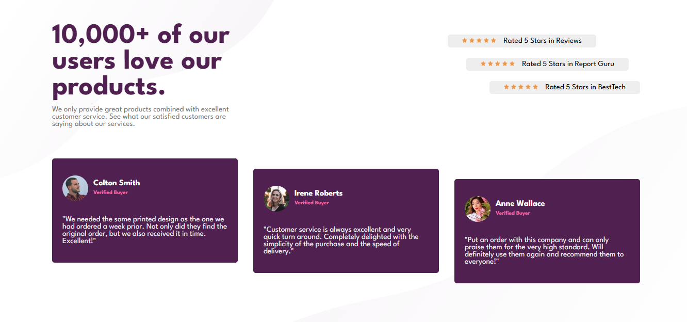

# Frontend Mentor - Social proof section

This is a solution to the [Social proof section
](https://www.frontendmentor.io/challenges/social-proof-section-6e0qTv_bA). Frontend Mentor challenges help you improve your coding skills by building realistic projects.

## Table of contents

- [Overview](#overview)
  - [The challenge](#the-challenge)
  - [Screenshot](#screenshot)
  - [Links](#links)
- [My process](#my-process)
  - [Built with](#built-with)
  - [What I learned](#what-i-learned)
  - [Continued development](#continued-development)
- [Author](#author)
- [Acknowledgments](#Acknowledgments)

## Overview

### The challenge

This project will test your layout skills. If you're starting to get confident with Flexbox or Grid, this will provide a nice challenge!

Your users should be able to:

- View the optimal layout for the site depending on their device's screen size

### Screenshot

### Links

- Solution URL: [here](https://github.com/olahasan/HTML_AND_CSS_Frontend-Mentor-NEWBIE-Social-proof-section)

- Live Site URL: [here](https://olahasan.github.io/HTML_AND_CSS_Frontend-Mentor-NEWBIE-Social-proof-section/)

## My process

### Built with

- Semantic HTML5 markup
- CSS custom properties
- Flexbox
- CSS Grid
- Mobile-first workflow

### What I Learned

While working on this project, I learned how to effectively use Flexbox and CSS Grid for layout and how to make the design responsive using media queries. I also practiced using CSS variables to manage colors and other design properties.

### Continued Development

In future projects, I plan to continue improving my skills in responsive design and explore more advanced CSS techniques. I also aim to enhance accessibility features in my projects.

### Author

Frontend Mentor - @olahasan 
GitHub - @olahasan

### Acknowledgments

Thanks to **Frontend Mentor** for providing this challenge and to the community for their support and feedback
